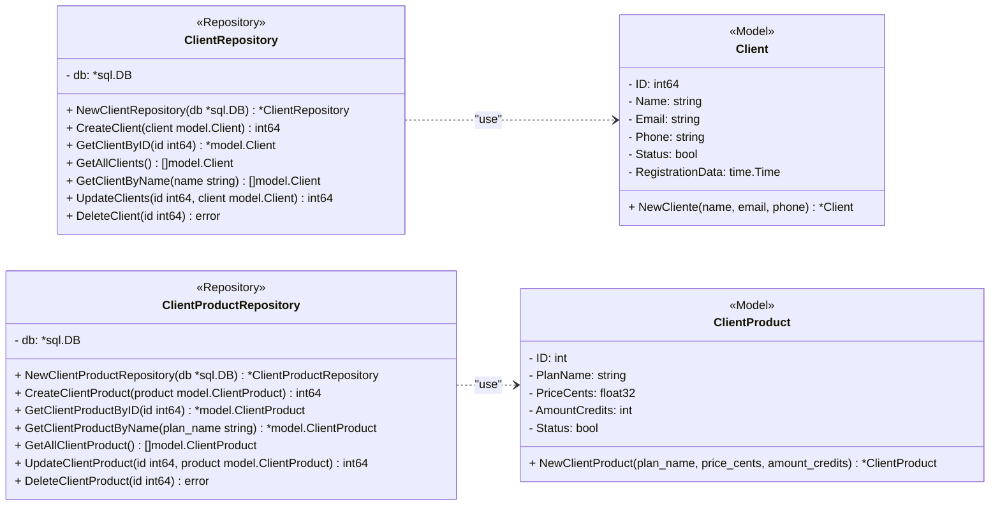

// shift + control + V

```mermaid
classDiagram
    direction LR

    class Client {
        <<Model>>
        - ID: int64
        - Name: string
        - Email: string
        - Phone: string
        - Status: bool
        - RegistrationData: time.Time
        + NewCliente(name, email, phone) *Client
    }

    class ClientProduct {
        <<Model>>
        - ID: int
        - PlanName: string
        - PriceCents: float32
        - AmountCredits: int
        - Status: bool
        + NewClientProduct(plan_name, price_cents, amount_credits) *ClientProduct
    }

    class ClientRepository {
        <<Repository>>
        - db: *sql.DB
        + NewClientRepository(db *sql.DB) *ClientRepository
        + CreateClient(client model.Client) int64
        + GetClientByID(id int64) *model.Client
        + GetAllClients() []model.Client
        + GetClientByName(name string) []model.Client
        + UpdateClients(id int64, client model.Client) int64
        + DeleteClient(id int64) error
    }

    class ClientProductRepository {
        <<Repository>>
        - db: *sql.DB
        + NewClientProductRepository(db *sql.DB) *ClientProductRepository
        + CreateClientProduct(product model.ClientProduct) int64
        + GetClientProductByID(id int64) *model.ClientProduct
        + GetClientProductByName(plan_name string) *model.ClientProduct
        + GetAllClientProduct() []model.ClientProduct
        + UpdateClientProduct(id int64, product model.ClientProduct) int64
        + DeleteClientProduct(id int64) error
    }

    ClientRepository ..> Client : "use"
    ClientProductRepository ..> ClientProduct : "use"
```
